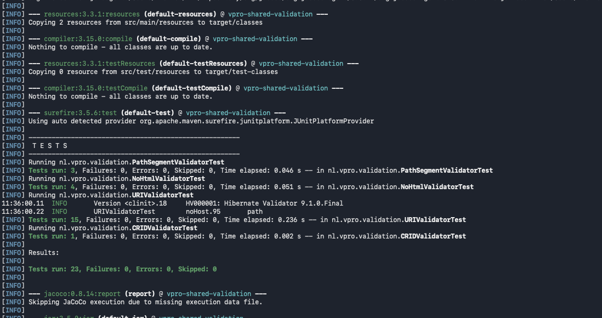

= Set up log4j2
:toc:
:version: 1.6

Just arranges dependencies to set up log4j2. Arranges logging from jul and slf4j (1 &amp; 2) to log4j2.

== Ratio

What I was seeing in many of the projects i was maintaining is that there was a log cruft just related to setting up logging. Especially in tests we oftentimes wound up with something
like this in every module of the project

- <module>/src/test/resources/log4j2-test.xml
- <module>/pom.xml several dependencies in the pom.xml to pull in log4j2, slf4j and perhaps jul bridges

The second thing can be avoided by putting it in the parent pom. But this is not the case for the first thing.

So, the basic idea is to just provide a simple jar dependency, which transitively pulls in the necessary dependencies. This is kind of 'opiniated'. We just want log4j2 to be the logging framework, and want to have as much of available logging to show up if wanted, where at least slf4j/log4j2/jul/system logging can be expected. Just one simple depenency suffices then.

A variant of the same dependency (with classifier 'test')  also includes a log4j2 configuration file.  This can be used as a 'test' dependency, and which suffices for most cases.

So, colorized, tab separated logging, no dates (which is pointless for tests). The pattern and can be overridden as a property of the surefire plugin, or as a command line parameter, which still keeps things simpler.

== Usage

Add the dependency to your project:

[source,xml, subs="attributes,specialchars"]
----
<dependency>
  <groupId>nl.mmprogrami</groupId>
  <artifactId>setup-log4j2</artifactId>
  <version>{version}</version>
</dependency>
----

This basically boils down to only two things:

. It'll transitively pull in necessary dependencies
. will route JUL and SLF4J (1 &amp; 2) to log4j2, so you can use those APIs and have the output end up in log4j2.

The only thing left to do is add a 'log4j2.xml' configuration file to your project, and you're good to go.

== As a test dependency

This is possible too:

[source,xml, subs="attributes,specialchars"]
----
<dependency>
  <groupId>nl.mmprogrami</groupId>
  <artifactId>setup-log4j2</artifactId>
  <version>{version}</version>
  <classifier>test</classifier>
  <scope>test</scope>
</dependency>
----

This will accomplish the same things, but this jar also includes a default `log4j2-test.xml` configuration file, which will then be used when running tests. This is useful if you want to use logging in your test with minimal hassle in setting it up. You don't even have to provide log4j2 configuration then. It will log INFO and above to the console.

[#_override_the_root_level]
=== Override the root level

You can any time place an overriding `src/main/test/resources/log4j-test.xml` anyway, but a few things can also be configured using system properties:

- the root level (`log4j2.root.level`), defaults to `TRACE`
- the level for the stdout appender (`log4j2.stdout.level`), defaults to `INFO`
- the pattern (`log4j2.pattern`)

With a command line override

[source, bash]
----
mvn -Dlog4j2.stdout.level=debug test
----

Or like so, as configuration of the surefire plugin

[source, xml]
----
<plugin>
  <artifactId>maven-surefire-plugin</artifactId>
  <version>3.5.6</version>
   <configuration>
     <systemPropertyVariables>
        <log4j2.stdout.level>DEBUG</log4j2.root.level>
        <log4j2.pattern>%d{ISO8601}&#x09;%highlight{%5.5p}&#x09;%c{1}&#x09;%m%n</log4j2.pattern>
     </systemPropertyVariables>
   </configuration>
 </plugin>
----

